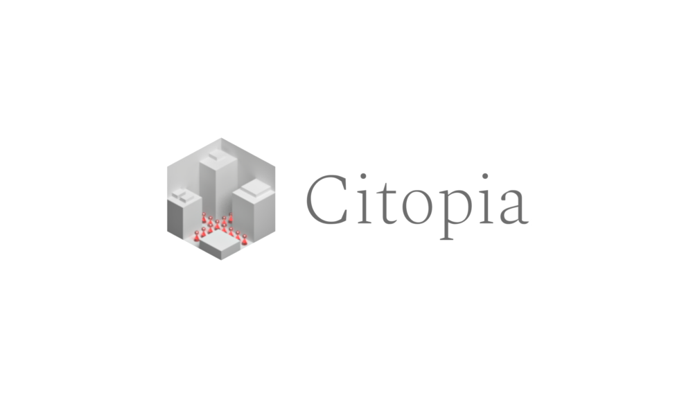

#
### Overview
Citopia is a high-performance crowd simulation project featuring detailed daily routines of diverse NPCs in a modern city environment. This project was developed in Swift using the Metal API by Deze Lyu, Paulina Tao, and Christine Kneer.
