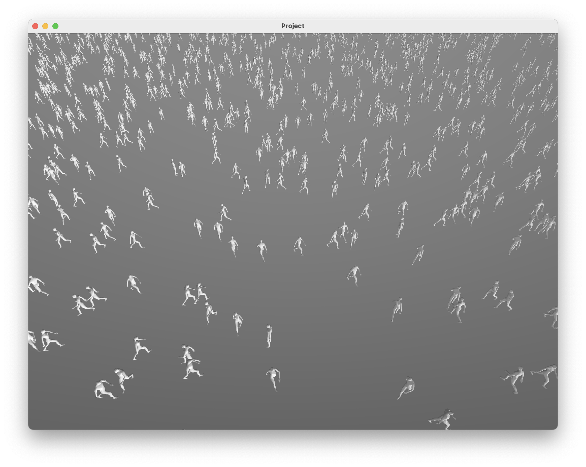

#
### Overview
Citopia is a high-performance crowd simulation project featuring detailed daily routines of diverse NPCs in a modern city environment. This project was developed in Swift using the Metal API by Deze Lyu, Paulina Tao, and Christine Kneer.
#
### License
This project is licensed under the Creative Commons Attribution-NonCommercial 4.0 International License, allowing for sharing and adaptation with appropriate credit given to the authors and for non-commercial purposes. The project also includes an experimental game engine developed by Deze Lyu, located in the Libraries folder. This engine remains in development and is not intended for external use. Additionally, third-party assets purchased from online asset stores have been used to visualize the simulation results. These assets have been extensively modified, and their usage fully complies with the respective licenses.
#
### Milestones
For Milestone 1, we implemented a simulation of 100,000 characters on a flat plane, with characters of different genders either standing still or walking in random directions at varying intervals. Our system efficiently selects visible characters within the camera frustum, sorts them by distance, and renders between 400 and 1,000 characters closest to the camera, adapting to platform capabilities such as mobile and desktop. The characters move and rotate smoothly, achieving responsive, real-time performance. We also developed an acceleration structure that organizes characters in a grid based on their current positions, although it has yet to be fully utilized. Additionally, we encountered an issue with abrupt transitions between idle and walking animations in the custom game engine’s animation system, which we plan to address in future milestones.

